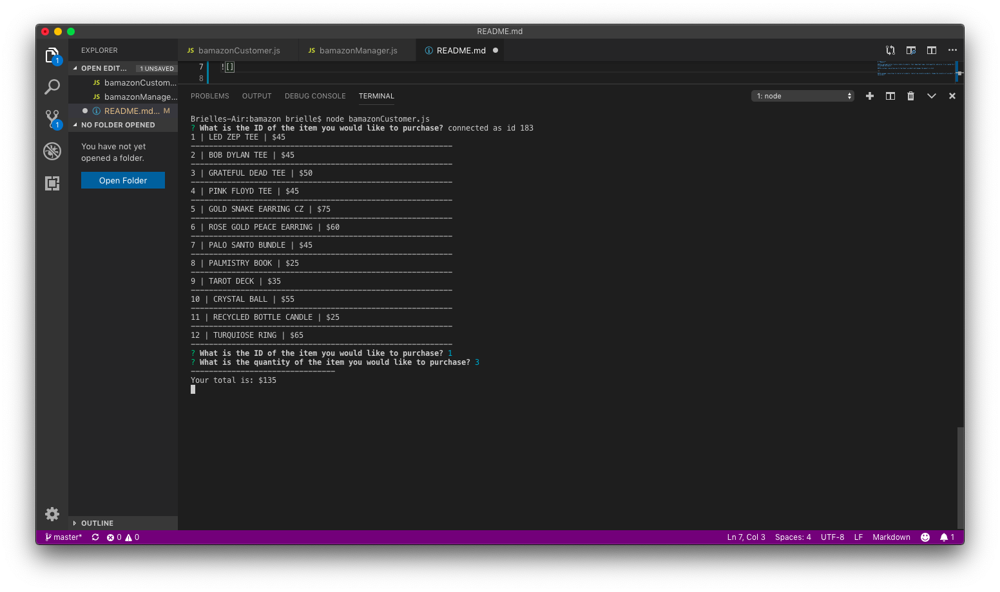
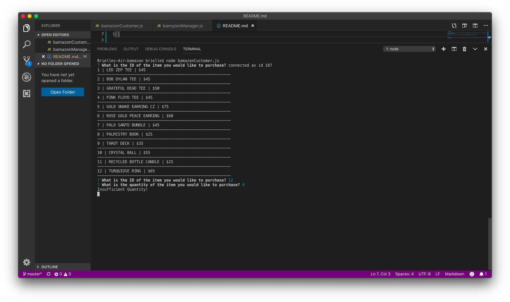
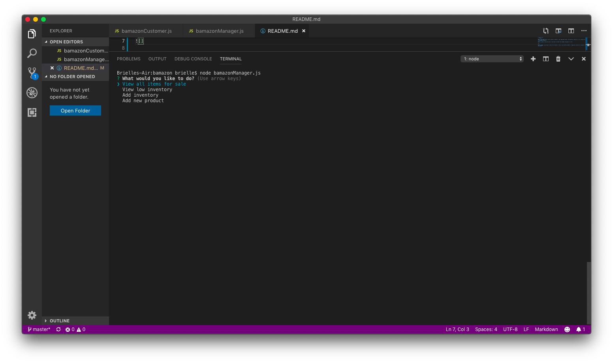
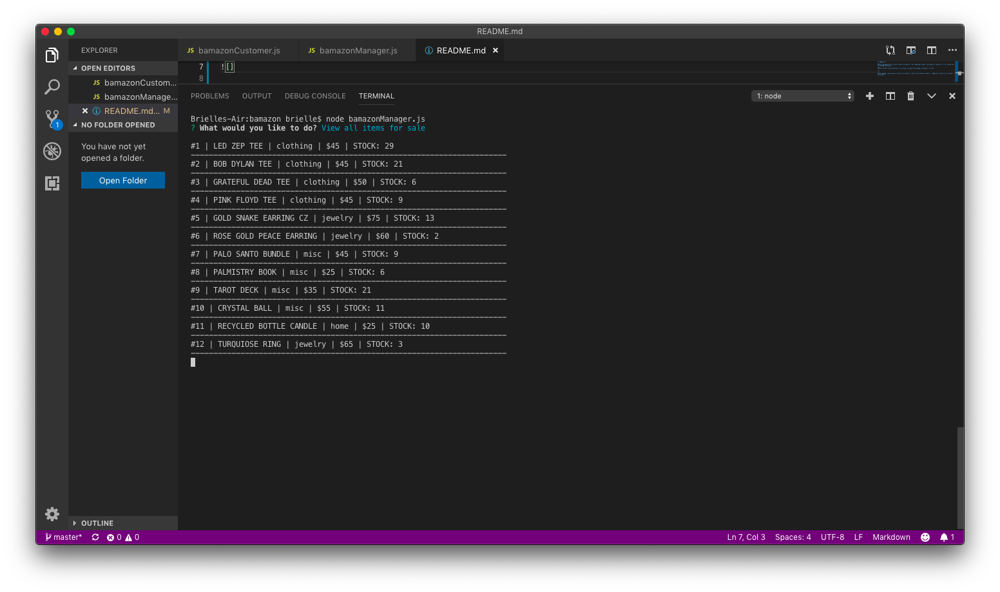
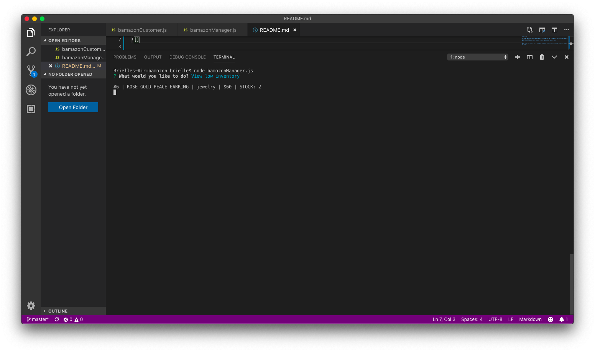
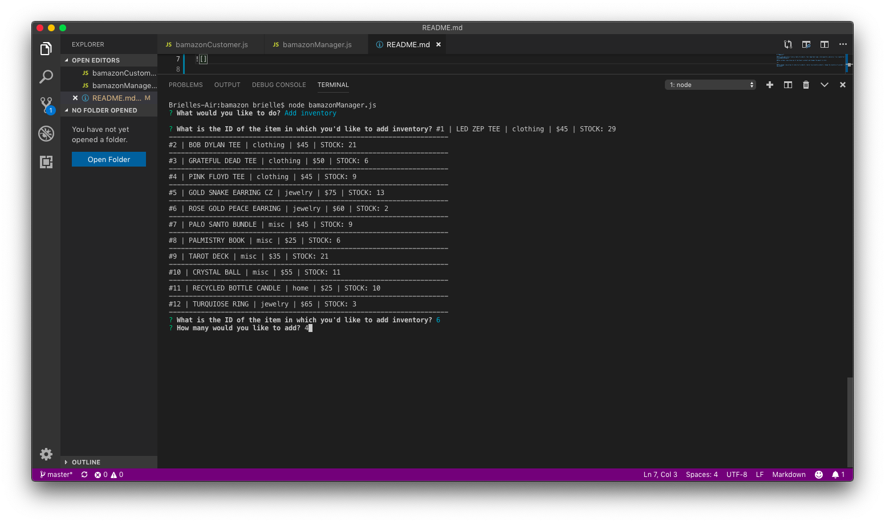
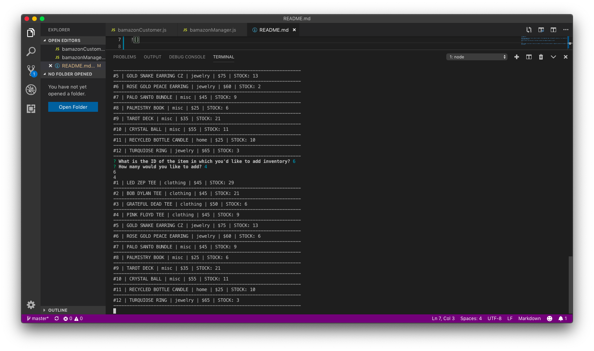
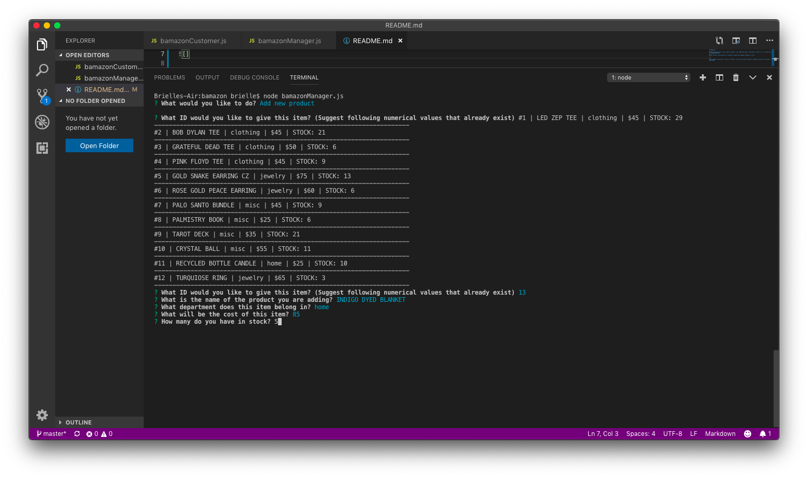
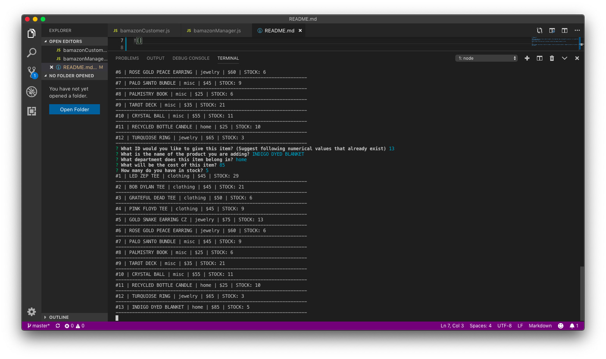
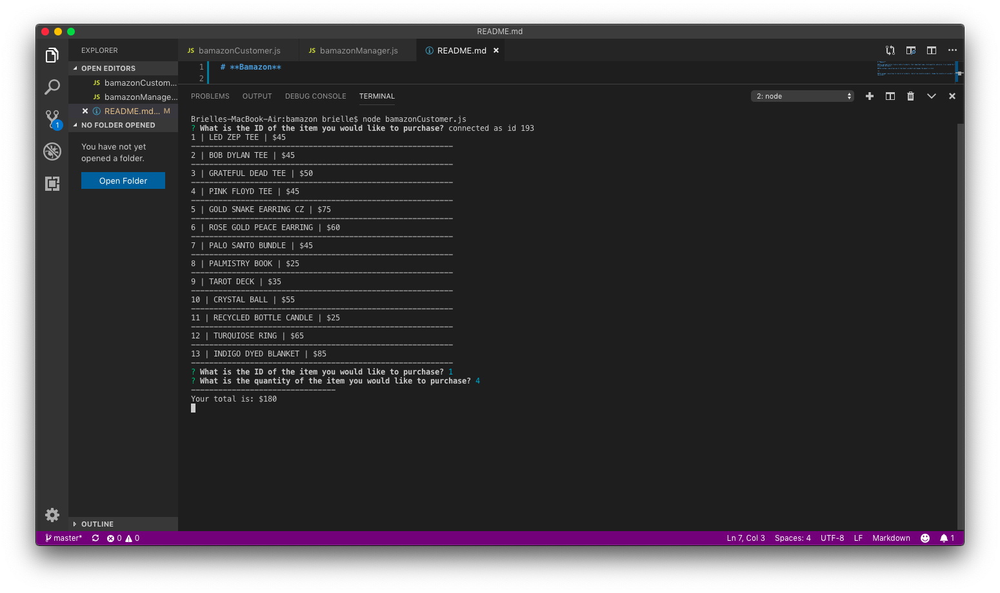

# **Bamazon**

#This web application tracks a table of products, their department name, stock quantity, and price. I've created the table in a database using MySQL Workbench. 

#The customer view allows you to "purchase" a product, changes the amount in stock, and provides total cost. 

#It also shows you an "Insufficient Quantity!" warning if we don't have enough stock to complete your order.

#The manager view:

#Allows to look at all products:

#Look at low inventory products:

#Change the inventory of a product:

#And add an entirely new product:

